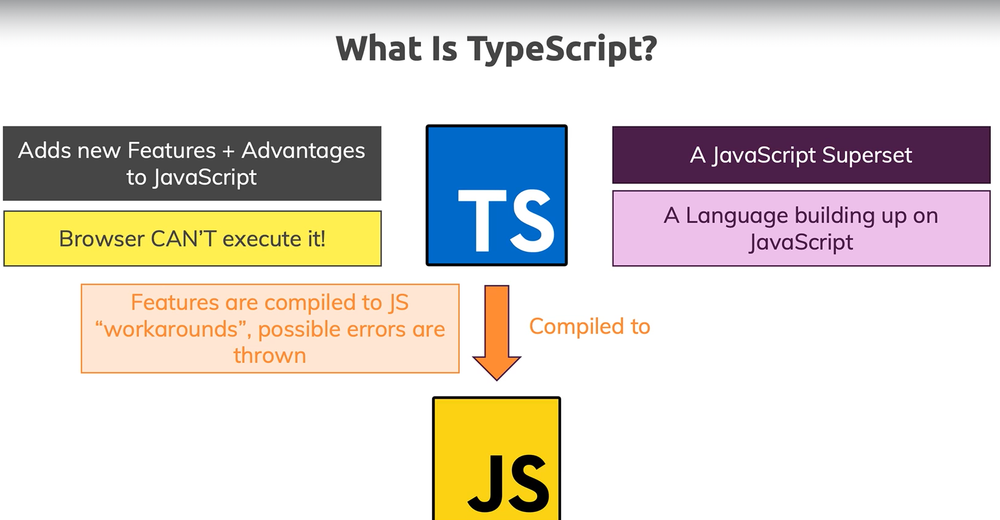
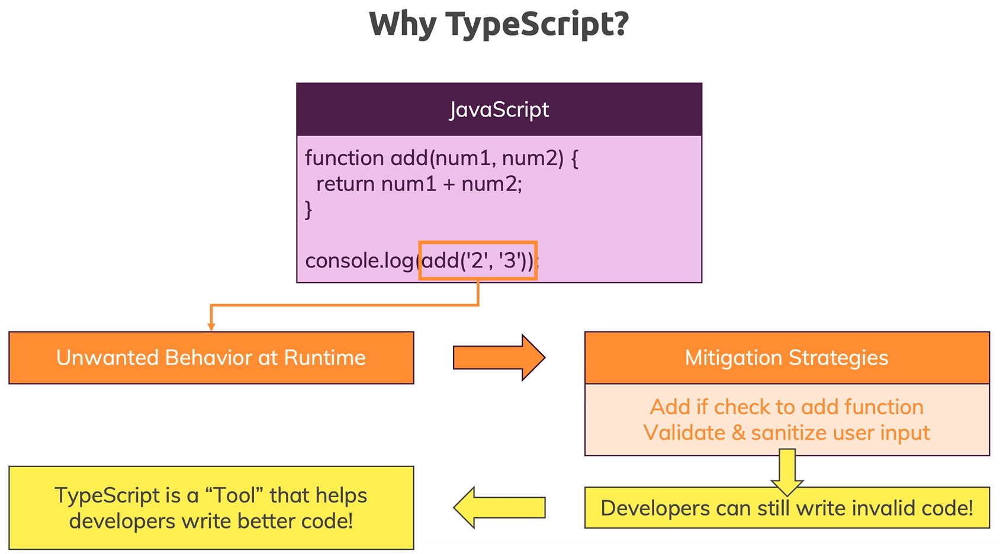
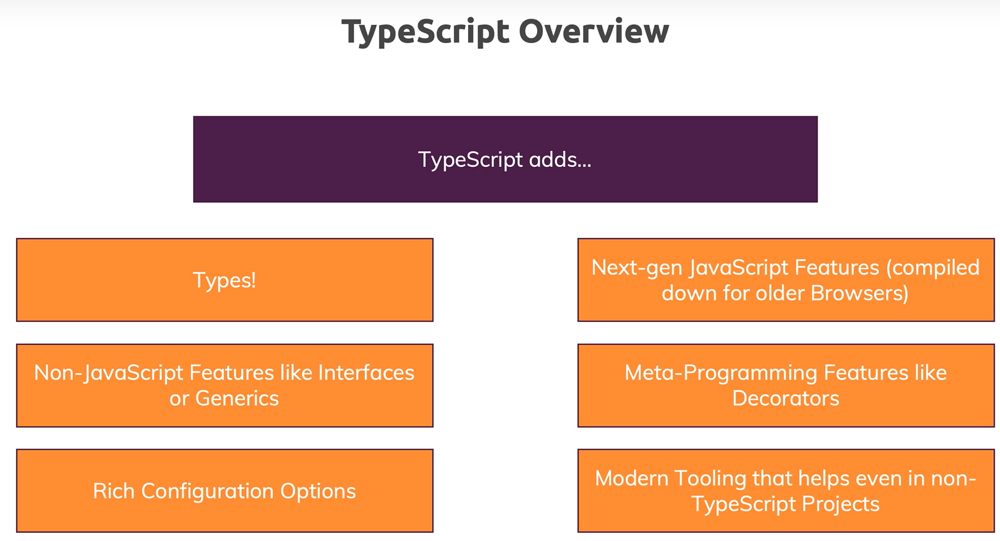
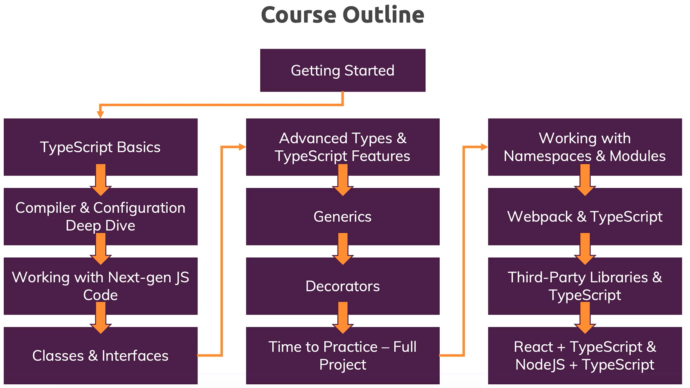

### Type Script 는 무엇이고 왜 사용해야 하는가?

- 자바스크립트의 더 나은 버전. 자바스크립트 언어를 가져와서 새로운 기능을 추가
- 브라우저같은 자바스크립트 실행 환경에서는 실행되지 않는다.
- 코드를 작성해서 실행하면 자바스크립트 코드로 컴파일 해줌. (타입스크립트 컴파일러)
- 좀 더 간편하게 작성해서 복잡한 자바스크립트 코드를 구현할 수 있다.
- 타입이 추가된다는 것이 특징. 스크립트 실행 전 미리 코드에 존재하는 오류를 확인할 수 있다.

